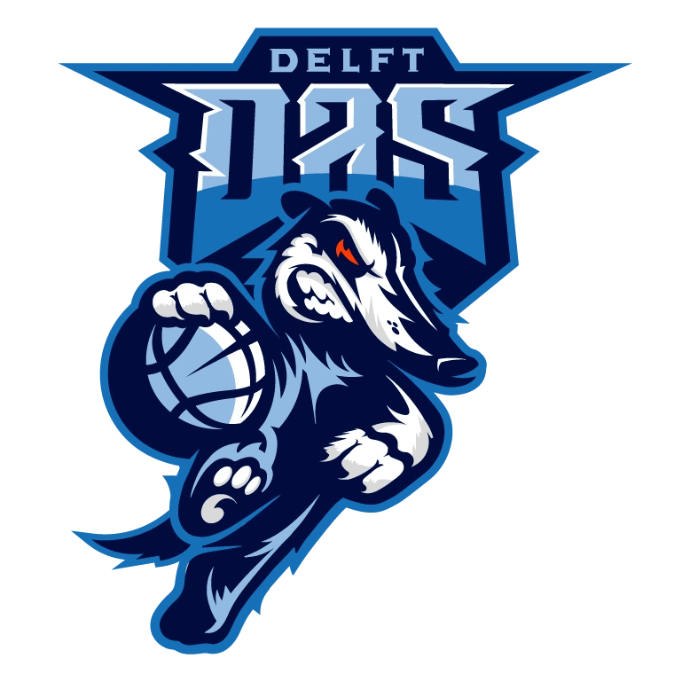

# DAS Toernooi Site

This is a project to make a tournament schedule/standings site for a basketball tournament hosted by [DAS Delft](https://www.das-delft.nl). The app shows attendees the current standings in a poule and also its schedule, but also offers an overview of the entire tournament day.

# Tech stack-up
This project is developed using [Svelte TS](https://svelte.dev/), a typescript compiler, for the client side code. The server side uses PHP and MariaDB database. Both are containerized in a docker container in development but only the PHP docker is in the repo.

  

